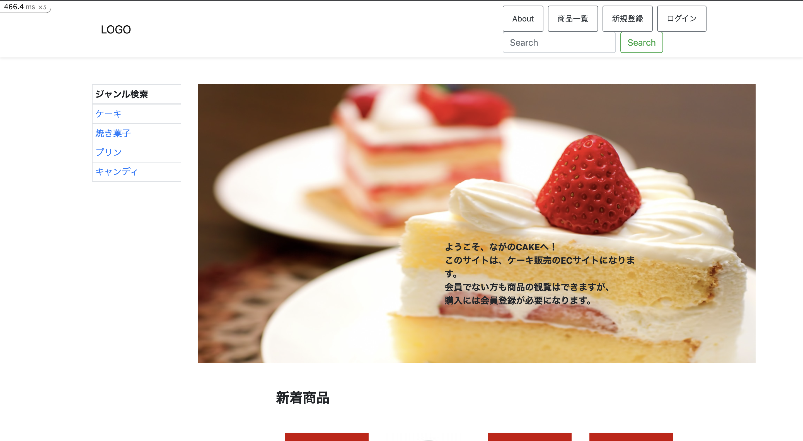

# ながのCAKE

## 概要

長野県にある小さな洋菓子店「ながのCAKE」の商品を通販するためのECサイト

## 実装機能

**会員側**

・サイトの閲覧はログインなしで行える

・カートへの商品追加はログインなしでは行えない

・会員登録、ログイン・ログアウト、退会ができる

・会員のログインはメールアドレスとパスワードで行う

・商品をカートに入れ、1度に複数種類、複数商品の購入ができること。また、カート内の商品は個数変更・削除ができる

・会員は配送先を複数登録しておくことが可能である

**管理者側**

・管理者用メールアドレスとパスワードでログインできる

・商品について、下記が行える
　　
  新規追加、編集、閲覧
　　　　
  販売停止（売切表示）
  
・会員登録されているユーザ情報の閲覧、編集、退会処理が行える

・ユーザの注文履歴が一覧・詳細表示できる

・ユーザの注文履歴が一覧・詳細表示でき注文ごとに注文ステータスの更新、注文商品ごとに製作ステータスの更新ができる

・ユーザの注文履歴が一覧・詳細表示できる

## 開発環境
cloud9

**使用言語**

・HTML&CSS

・Ruby

・Ruby 2.6.3

・SQlite3 3.33.0

・HTML5

**フレームワーク**

・Ruby on rails (5.2.4.4)

**Gem**

・device

・refile

・refile-mini-magick

・dotenv-rails

・bootstrap-sass

・jquery-rails

・kaminari

## 使用方法

**顧客側**

1.はじめに会員登録をお願い致します。登録なしに商品を閲覧することは可能ですが、注文する際は必須になります。

2.お好きな商品が見つかりましたらカートに入れていただき、注文情報入力へお進みください。

3.支払い方法、配送先等を選択していただき、注文確定を押すと注文が完了いたします。

**管理者側**

1.まず管理者登録をお願いいたします。登録が完了しますと、管理者機能が使用可能になります。

2.ジャンルと商品を登録していただきますと、顧客サイトで閲覧が可能になります。

3.顧客から注文がありますと、注文一覧に表示され、詳細が確認できます。入金が確認できたら注文ステータスを変更し、

4.製作が終了しましたら製作ステータスを変更してください。（それぞれ連動して変更が反映されます）

5.顧客一覧から顧客詳細の確認・変更・退会が可能です。

## 作成者

shigenaga77
